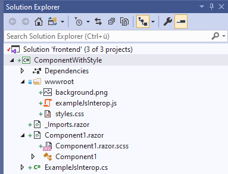
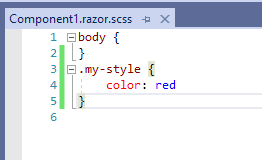
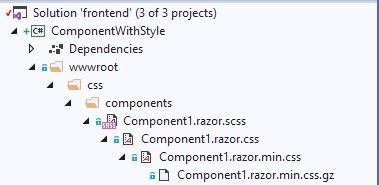

# Step-by-step how to use Blazor.LazyStyleSheet

1. Add a file with name {component-name}.razor.scss to your solution. The file will be automatically displayed as nested unter {component-name}.razor in Visual Studio.

2. Edit your style as you wish, e.g. by adding some color

3. Build your solution. Blazor.LazyStyleSheet automatically creates a copy of your style file in the subfolder `wwwroot/css/components/`.

